# Complete Guidelines: Section C (Sports-Related Case Studies – Physiotherapy)
### Sports Authority of India (SAI) – Performance Analyst (Physiotherapy) Recruitment

---

### 1. Key Overview for Unreserved (UR) Category Candidates

| Parameter | Details |
| :--- | :--- |
| **Post** | Performance Analyst (Physiotherapy) – Regular Basis (Pay Level 6: ₹35,400 – ₹1,12,400) |
| **Vacancies (UR)** | **12** (out of 24 total Physiotherapy vacancies) |
| **Upper Age Limit** | Up to **30 years** (Strict cutoff for UR; no category relaxation unless departmental/contractual SAI service) |
| **Application Fee** | **₹2,000/-** (Non-refundable, paid online via UPI / Net Banking / RTGS / NEFT) |
| **Selection Mode** | **100% based on Computer-Based Test (CBT)** — No interview / supplementary weightage |
| **CBT Duration & Total** | **2 Hours (120 minutes)** — 100 Multiple Choice Questions (100 Marks) |
| **Section C Weightage** | **20 Marks** (20 Analytical / Passage-Based MCQs — 20% of total score) |
| **Negative Marking** | **0.25 marks (1/4th)** deducted for every incorrect answer |
| **Decisive Tie-Breaker** | **Priority #1**: In the event of a tie in total CBT score, **higher marks in Section C** directly decides the higher merit rank! |

---

### 2. Nature & Assessment Philosophy of Section C

Unlike Section A (broad sports science) or Section B (applied discipline theory), **Section C assesses high-level clinical reasoning, diagnostic acumen, and practical problem-solving in high-performance sporting contexts**.

* **Scenario-Based Framing:** Questions are structured as clinical vignettes detailing an athlete's sport, age, mechanism of injury, clinical presentation, physical examination findings, or functional testing data.
* **Core Competencies Tested:**
  1. **Analytical Reasoning:** Synthesizing subjective athlete history with objective biomechanical and physical findings.
  2. **Data & Test Interpretation:** Interpreting clinical orthopedic tests, range of motion (ROM) deficits, dynamometry strength ratios, and functional movement screens.
  3. **Evidence-Based Decision Making:** Selecting appropriate immediate acute interventions, conservative vs. surgical referral pathways, and structured exercise therapy progressions.
  4. **Return to Play (RTP) Decisions:** Applying objective functional benchmarks (LSI $\ge 90\%$, hop tests, psychological readiness) rather than arbitrary timelines.

---

### 3. Detailed Syllabus & Clinical Case Themes (Section C – Physiotherapy)

*(Derived from **Annexures A & B** of the official SAI Recruitment Notification)*

```mermaid
flowchart TD
    ROOT["Section C: Sports-Related Case Studies (20 Marks)"]
    
    T1["1. Lower Extremity Scenarios"]
    T2["2. Upper Extremity Scenarios"]
    T3["3. Spine & Pelvis Scenarios"]
    T4["4. On-Field & Emergency Triage"]
    T5["5. Return to Play (RTP) Frameworks"]
    
    ROOT --> T1
    ROOT --> T2
    ROOT --> T3
    ROOT --> T4
    ROOT --> T5

    T1 --> T1a["ACL & Meniscal Tears (Lachman / Pivot Shift)"]
    T1 --> T1b["Hamstring Strains (Biceps Femoris vs Semimembranosus)"]
    T1 --> T1c["PFPS & Patellar Tendinopathy (HSR / VMO)"]
    T1 --> T1d["Ankle Inversion Sprain (ATFL / CFL / High Ankle)"]
    T1 --> T1e["MTSS vs Tibial Stress Fractures & Sever's Disease"]

    T2 --> T2a["Overhead Thrower's Shoulder & GIRD Protocol"]
    T2 --> T2b["Subacromial Pain Syndrome & Impingement (SAPS)"]
    T2 --> T2c["Rotator Cuff Tears & SLAP Lesions"]
    T2 --> T2d["Lateral Epicondylalgia & de Quervain's Tenosynovitis"]

    T3 --> T3a["Spondylolysis / Listhesis in Fast Bowlers (Stork Test)"]
    T3 --> T3b["Discogenic Radiculopathy (SLR) vs SI Joint Dysfunction"]

    T4 --> T4a["SCAT6 Concussion Red Flags & 6-Stage Graduated RTP"]
    T4 --> T4b["Spinal Trauma Immobilization & Log-Roll Technique"]
    T4 --> T4c["Exertional Heat Stroke (Cool First, Transport Second)"]

    T5 --> T5a["Limb Symmetry Index (LSI >= 90% via Dynamometry)"]
    T5 --> T5b["Single-Leg Functional Hop Test Battery (>= 90% LSI)"]
    T5 --> T5c["Psychological Readiness (ACL-RSI) & Agility Drills"]
```



---

#### **Theme 1: Lower Extremity Injury Scenarios**

1. **Knee Joint Complex:**
   * **Acute ACL Tear:** Deceleration, cutting, landing in dynamic valgus and internal/external rotation. Presentation: Audible "pop", immediate hemarthrosis within 2 hours, instability. Diagnostic gold standard: *Lachman test* (highest sensitivity), *Pivot Shift test* (highest specificity).
   * **Meniscal Injuries:** Twisting on a loaded flexed knee. Delayed joint effusion (24–48 hours), joint-line tenderness, mechanical locking/catching. Tests: *Thessaly test*, *McMurray test*, *Apley's compression test*.
   * **Patellofemoral Pain Syndrome (PFPS):** Anterior knee pain worsened by stair descent, squatting, and prolonged sitting ("theater sign"). Case intervention: Quadriceps strengthening with emphasis on Vastus Medialis Oblique (VMO), hip abductor/external rotator strengthening, dynamic knee valgus correction.
   * **Patellar Tendinopathy ("Jumper's Knee"):** Focal inferior patellar pole pain load-dependent on energy storage/release (jumping/landing). Management: Heavy Slow Resistance (HSR) / decline board isometric-eccentric progressions.

2. **Thigh & Groin Complex:**
   * **Hamstring Strain Injuries (HSI):** Sudden "pop" or sharp pull during maximum sprinting $\rightarrow$ **Biceps femoris long head** (most common); gradual overstretch during high kicking/dance $\rightarrow$ **Semimembranosus** proximal free tendon. Protocol: Lengthened-state eccentric loading (Nordic hamstring curls), sprint biomechanics retraining.
   * **Groin Pain Taxonomy (Doha Consensus):**
     * *Adductor-related:* Tenderness at adductor longus insertion, pain on resisted adduction (Squeeze test, Copenhagen adduction rehab).
     * *Iliopsoas-related:* Pain on resisted hip flexion / psoas stretch.
     * *Inguinal-related:* Inguinal canal tenderness, pain on abdominal contraction with no palpable hernia.
     * *Pubic-related:* Local tenderness over pubic symphysis.

3. **Leg, Ankle & Foot Complex:**
   * **Lateral Ankle Sprains:** Plantarflexion + inversion mechanism. Primary injured ligament: **Anterior Talofibular Ligament (ATFL)** $> \text{Calcaneofibular Ligament (CFL)} > \text{Posterior Talofibular Ligament (PTFL)}$. High ankle / syndesmotic sprain: External rotation/dorsiflexion mechanism (Positive *Squeeze test*, *Kleiger test*).
   * **Achilles Tendinopathy vs. Rupture:** Midportion vs. insertional tendinopathy (Silbernagel combined eccentric-concentric protocols). Complete rupture: Sudden sensation of "being kicked in the calf", palpable gap, positive **Thompson (Simmonds) squeeze test**.
   * **Medial Tibial Stress Syndrome (MTSS) vs. Tibial Stress Fracture:** MTSS presents with diffuse posteromedial tibial border tenderness $>5\text{ cm}$, pain during warm-up that eases during activity; Stress fracture presents with focal pinpoint bony tenderness $\le 5\text{ cm}$, pain at rest/night, positive tuning fork/percussion test, requiring MRI.
   * **Pediatric / Adolescent Apophysitis:**
     * *Sever's Disease (Calcaneal apophysitis):* Active adolescent athletes (10–14 years), heel pain aggravated by running/jumping, tenderness at calcaneal insertion.
     * *Osgood-Schlatter Disease:* Tibial tuberosity apophysitis during adolescent growth spurts.

---

#### **Theme 2: Upper Extremity & Overhead Athlete Scenarios**

1. **Shoulder Complex in Overhead Athletes (Cricket Bowlers, Swimmers, Javelin, Badminton):**
   * **Glenohumeral Internal Rotation Deficit (GIRD):** Thrower's shoulder presenting with significant loss of internal rotation ($>18^\circ–20^\circ$) accompanied by increased external rotation on the dominant side. Management: Posterior capsule stretching (Sleeper stretch, cross-body adduction) and posterior cuff strengthening.
   * **Subacromial Pain Syndrome (SAPS) / Impingement:** Progressive anterolateral shoulder pain during overhead stroke acceleration, positive *Hawkins-Kennedy* and *Neer* impingement tests, painful arc ($60^\circ–120^\circ$).
   * **Rotator Cuff Pathology:** Supraspinatus isolation (*Empty Can / Jobe's test*, *Full Can test*); Infraspinatus/Teres Minor (*Hornblower's sign*, resisted ER); Subscapularis (*Lift-off test*, *Belly-press test*).
   * **Superior Labrum Anterior-to-Posterior (SLAP) Lesions:** Deep joint clicking, pain with overhead throwing acceleration/deceleration. Tests: *O'Brien's active compression test*, *Biceps load test II*, *Crank test*.

2. **Elbow, Wrist & Hand Scenarios:**
   * **Lateral Epicondylalgia ("Tennis Elbow"):** Pain at lateral epicondyle during resisted wrist extension (Cozen's test) and resisted middle finger extension (Maudsley's test) due to microtrauma of the Extensor Carpi Radialis Brevis (ECRB) origin. Management: Eccentric wrist extensor loading (Tyler Twist with flexbar), manual therapy.
   * **Medial Epicondylalgia ("Golfer's Elbow"):** Microtrauma at the common flexor-pronator origin (resisted wrist flexion and pronation).
   * **de Quervain's Tenosynovitis:** Radial styloid pain in racquet/bat grip athletes affecting Abductor Pollicis Longus (APL) and Extensor Pollicis Brevis (EPB). Diagnostic gold standard: *Finkelstein's test*.

---

#### **Theme 3: Spine, Pelvis & Core Scenarios**

1. **Lumbar Spondylolysis & Spondylolisthesis:**
   * Stress fracture of the pars interarticularis, prevalent in cricket fast bowlers (front-foot strike rotational extension) and gymnasts.
   * Clinical presentation: Extension and ipsilateral rotation reproducing low back pain; positive **Stork standing (single-leg hyperextension) test**.
2. **Discogenic Radiculopathy vs. Sacroiliac Dysfunction:**
   * Lumbar disc herniation: Dermatomal radiation, positive *Straight Leg Raise (SLR / Lasègue)* and *Slump test*, centralization of symptoms with directional preference (McKenzie).
   * SI Joint Dysfunction: Localized PSIS pain, positive cluster of provocation tests (*FABER / Patrick's*, *Thigh Thrust*, *Gaenslen's*, *Distraction*, *Compression*).

---

#### **Theme 4: On-Field Emergency Management, Triage & Concussion**

1. **Sports Concussion Protocols (SCAT6 / Child SCAT6 – CISG Consensus):**
   * **Red Flags (Immediate Emergency Hospital Transfer):** Neck pain/tenderness, double vision, weakness/tingling/burning in arms or legs, severe or increasing headache, seizure/convulsion, loss of consciousness, deteriorating conscious state, repeated vomiting, increasing restlessness or combativeness.
   * **Return to Play Progression:** Minimum 24–48 hours symptom-free before initiating graduated 6-stage protocol: (1) Symptom-limited activity $\rightarrow$ (2) Light aerobic exercise $\rightarrow$ (3) Sport-specific exercise $\rightarrow$ (4) Non-contact training drills $\rightarrow$ (5) Full-contact practice (medical clearance mandatory) $\rightarrow$ (6) Return to competition.
2. **Spinal Trauma & Catastrophic Injury:**
   * Immediate cervical spine in-line manual stabilization ($<C>ABCDE$). Rigid collar application, coordinated log-roll technique onto a scoop stretcher or vacuum mattress.
3. **Exertional Heat Stroke (EHS):**
   * Core body temperature $>40^\circ\text{C}$ ($104^\circ\text{F}$) with central nervous system dysfunction (confusion, ataxia, delirium, collapse).
   * Protocol: **"Cool First, Transport Second"** — Immediate whole-body Cold Water Immersion (CWI, $1.5^\circ–15^\circ\text{C}$) with vigorous water stirring until core temp reaches $\le 38.6^\circ\text{C}$ ($101.5^\circ\text{F}$) before ambulance transfer.

---

#### **Theme 5: Return to Play (RTP) Decision Frameworks**

Case questions evaluate whether an athlete meets objective criteria to safely progress across the RTP continuum:

```
[Injury / Surgery] 
       ↓ 
[Phase 1: Acute Protection & Pain Resolution]
       ↓ 
[Phase 2: Full Symmetrical Active/Passive ROM]
       ↓ 
[Phase 3: Symmetrical Muscular Strength (Dynamometry LSI ≥ 90%)]
       ↓ 
[Phase 4: Functional Hop Test Battery (Single, Triple, Crossover, 6m Timed ≥ 90% LSI)]
       ↓ 
[Phase 5: Reactive Strength Index (RSI) & Y-Balance Dynamic Stability]
       ↓ 
[Phase 6: Psychological Readiness (ACL-RSI Score ≥ 60–75%)]
       ↓ 
[Phase 7: Sport-Specific High-Speed Agility Drills (Zero Effusion/Pain)]
       ↓ 
[Full Clearance: Return to Performance]
```

---

### 4. Standard Reference Books & Guides (SAI Benchmark Sources)

The official SAI notification questions are benchmarked directly against these authoritative medical texts:

| Category | Recommended Textbooks / Consensus Documents |
| :--- | :--- |
| **Sports Medicine & Clinical Cases** | • ***Brukner & Khan’s Clinical Sports Medicine* (5th Edition, Vols 1 & 2)** — *[PRIMARY GOLD STANDARD]*<br>• *Sports Injury Prevention and Rehabilitation* (David Joyce & Daniel Lewindon) |
| **Orthopaedic Assessment** | • ***Orthopedic Physical Assessment* (David J. Magee)**<br>• *Special Tests for Orthopedic Examination* (Jeff G. Konin) |
| **Therapeutic Exercise & Rehab** | • ***Therapeutic Exercise: Foundations and Techniques* (Carolyn Kisner & Lynn Allen Colby)** |
| **Biomechanics & Movement** | • ***Kinesiology of the Musculoskeletal System* (Donald A. Neumann)**<br>• *Gait Analysis: Normal and Pathological Function* (Jacquelin Perry & Judith Burnfield) |
| **International Consensus Guidelines** | • **SCAT6 Consensus Statement on Concussion in Sport** (*BJSM 2023*)<br>• **Doha Agreement Meeting on Groin Pain in Athletes** (*BJSM*)<br>• **IOC Consensus Statements on Return to Sport and Load Management** |

---

### 5. High-Yield Strategy for Scoring 18+/20 in Section C

1. **Deconstruct the Case Vignette Methodically:**
   $$\text{Sport} + \text{Age/Level} + \text{Mechanism of Injury} + \text{Aggravating Movements} + \text{Special Test Findings} \longrightarrow \text{Precise Diagnosis / Management}$$
2. **Prioritize Evidence-Based Active Care Over Passive Modalities:**
   * In rehabilitation scenarios, questions consistently prioritize **eccentric/heavy slow resistance loading, motor control, and kinetic chain strengthening** over passive modalities (like ultrasound or superficial heat).
3. **Know Test Sensitivity vs. Specificity:**
   * Be ready to answer questions specifically asking for the *most sensitive* test (screening/ruling out, e.g., Lachman for ACL) vs. *most specific* test (confirming/ruling in, e.g., Pivot Shift for ACL).
4. **Leverage Section C as the Ultimate Rank Decider:**
   * Because Section C is the **#1 tie-breaker in the recruitment exam**, securing high accuracy here gives UR candidates the decisive edge in securing one of the 12 Unreserved vacancies.
5. **Mitigate Negative Marking (0.25 Penalty):**
   * If a case scenario provides 2–3 specific clinical clues (e.g., age, mechanism, resisted movement reproduction), eliminate physiologically incompatible options before committing your answer.

---

### 6. Official SAI Sample Questions (Annexure B: Section C – Physiotherapy Case Studies)

*(Extracted verbatim from Annexure B of the official notification with comprehensive clinical case deconstructions)*

#### **Case Study 1 (Acute Hamstring Strain in Sprinting)**
> **Clinical Scenario:** A 22-year-old male footballer reports a sudden “pop” in the posterior thigh while sprinting, followed by immediate pain and difficulty continuing play. According to standard sports medicine texts, the MOST likely structure injured is:
* A. Adductor longus
* B. Semimembranosus
* C. Biceps femoris long head
* D. Gracilis

**Correct Answer:** **C. Biceps femoris long head**
> **Case Analysis & Reasoning:** High-speed sprinting imposes maximum eccentric lengthening and peak contraction load during the terminal swing phase. The **long head of biceps femoris** is under maximal strain across both the hip and knee joints simultaneously, making it the most frequently injured muscle ($\sim 80\%$ of all hamstring strain injuries in sprinters and footballers).

---

#### **Case Study 2 (Lateral Elbow Overuse in Racquet Sports)**
> **Clinical Scenario:** A professional badminton player presents with lateral elbow pain aggravated during backhand strokes. Resisted wrist extension reproduces symptoms. Based on textbook diagnostic criteria, the MOST likely diagnosis is:
* A. Golfer’s elbow
* B. Radial tunnel syndrome
* C. Lateral epicondylalgia
* D. Posterior interosseous nerve palsy

**Correct Answer:** **C. Lateral epicondylalgia**
> **Case Analysis & Reasoning:** Repetitive eccentric and isometric loading of the wrist extensors during backhand stroke impacts induces angiofibroblastic tendinosis predominantly at the **Extensor Carpi Radialis Brevis (ECRB)** origin at the lateral epicondyle. Resisted wrist extension with radial deviation (Cozen's test) is the classic diagnostic physical sign.

---

#### **Case Study 3 (Anterior Knee Pain in Basketball)**
> **Clinical Scenario:** A 19-year-old basketball player complains of anterior knee pain, worse during stair descent and prolonged sitting. There is no history of trauma. According to sports rehabilitation texts, the MOST appropriate initial management is:
* A. Complete rest for 6 weeks
* B. Quadriceps strengthening with emphasis on VMO and hip abductors
* C. Knee immobilization
* D. Surgical patellar realignment

**Correct Answer:** **B. Quadriceps strengthening with emphasis on VMO and hip abductors**
> **Case Analysis & Reasoning:** The classic "theater sign" (pain with prolonged sitting) and worsening with eccentric loading during stair descent are hallmarks of Patellofemoral Pain Syndrome (PFPS). High-level evidence-based consensus guidelines mandate multimodal conservative exercise therapy targeting Vastus Medialis Oblique (VMO) timing and hip abductor/gluteal strengthening to optimize dynamic patellar tracking. Complete rest or immobilization causes rapid arthrogenic muscle inhibition and worsens outcomes.

---

#### **Case Study 4 (Inversion Ankle Injury in Sprinters)**
> **Clinical Scenario:** A sprinter sustains an ankle injury with plantarflexion and inversion. Immediate swelling is noted around the lateral malleolus. According to orthopedic assessment textbooks, the MOST commonly injured ligament is:
* A. Calcaneofibular ligament
* B. Posterior talofibular ligament
* C. Anterior talofibular ligament
* D. Deltoid ligament

**Correct Answer:** **C. Anterior talofibular ligament**
> **Case Analysis & Reasoning:** In a plantarflexed and inverted position, the **Anterior Talofibular Ligament (ATFL)** becomes fully taut and oriented parallel to the long axis of the talus, bearing the initial mechanical failure load before the calcaneofibular ligament (CFL) or posterior talofibular ligament (PTFL).

---

#### **Case Study 5 (Shoulder Internal Rotation Deficit in Fast Bowlers)**
> **Clinical Scenario:** A 24-year-old fast bowler reports shoulder pain during the late cocking phase of throwing. Examination shows increased external rotation and decreased internal rotation compared to the non-dominant side. This pattern is classically described as:
* A. Shoulder impingement syndrome
* B. Multidirectional instability
* C. Glenohumeral internal rotation deficit (GIRD)
* D. Adhesive capsulitis

**Correct Answer:** **C. Glenohumeral internal rotation deficit (GIRD)**
> **Case Analysis & Reasoning:** Repetitive overhead throwing causes osseous humeral retroversion and posterior capsular/rotator cuff contracture. A loss of glenohumeral internal rotation $>18^\circ–20^\circ$ relative to the non-dominant shoulder (or a $>5^\circ$ deficit in Total Motion Arc) defines GIRD, predisposing overhead throwers to internal impingement and superior labral (SLAP) tears.

---

#### **Case Study 6 (Traumatic Knee Instability & Special Tests)**
> **Clinical Scenario:** A young volleyball player lands awkwardly from a jump and reports knee instability. Lachman test is positive. According to standard sports injury textbooks, the MOST sensitive clinical test for this injury is:
* A. Anterior drawer test
* B. Pivot shift test
* C. Lachman test
* D. McMurray test

**Correct Answer:** **C. Lachman test**
> **Case Analysis & Reasoning:** For assessing anterior cruciate ligament (ACL) integrity, the **Lachman test** (performed at $20^\circ–30^\circ$ flexion) has the highest sensitivity ($\sim 85–95\%$), minimizing false negatives compared to the Anterior Drawer test (which is confounded by hamstring spasm). The Pivot Shift test has higher specificity ($\sim 97–99\%$) but lower sensitivity in acute, guarded presentations.

---

#### **Case Study 7 (Exertional Leg Pain in Runners)**
> **Clinical Scenario:** A long-distance runner presents with medial tibial pain aggravated by training volume increase. X-ray is normal. Sports medicine textbooks describe this condition MOST commonly as:
* A. Tibial stress fracture
* B. Chronic exertional compartment syndrome
* C. Medial tibial stress syndrome
* D. Popliteal artery entrapment

**Correct Answer:** **C. Medial tibial stress syndrome**
> **Case Analysis & Reasoning:** Medial Tibial Stress Syndrome (MTSS / "shin splints") is an exercise-induced traction periostitis presenting with diffuse posteromedial tibial border tenderness ($>5\text{ cm}$) associated with rapid volume increases. Standard plain radiographs are typically normal in early stages, whereas focal pinpoint bony tenderness ($\le 5\text{ cm}$) would point toward a cortical stress fracture requiring MRI.

---

#### **Case Study 8 (Progressive Shoulder Pain in Competitive Swimmers)**
> **Clinical Scenario:** A competitive swimmer complains of progressive shoulder pain without a single traumatic event. Pain increases during overhead activity, and Hawkins–Kennedy test is positive. The MOST likely diagnosis is:
* A. Rotator cuff tear
* B. Shoulder instability
* C. Subacromial impingement syndrome
* D. Biceps tendon rupture

**Correct Answer:** **C. Subacromial impingement syndrome**
> **Case Analysis & Reasoning:** "Swimmer's shoulder" typically arises from repetitive mechanical compression of the supraspinatus tendon, subacromial bursa, and long head of biceps against the coracoacromial arch during overhead recovery strokes. A positive Hawkins-Kennedy test (passive internal rotation in $90^\circ$ forward flexion) specifically drives the greater tuberosity under the coracoacromial ligament, reproducing subacromial impingement pain.

---

#### **Case Study 9 (Return-to-Sport Decision Criteria Post-ACL Reconstruction)**
> **Clinical Scenario:** A football player returns to sport after ACL reconstruction. According to rehabilitation textbooks, the MOST critical criterion before return-to-sport decision-making is:
* A. Time since surgery
* B. Absence of pain
* C. Symmetry in strength and functional hop tests
* D. Normal MRI appearance

**Correct Answer:** **C. Symmetry in strength and functional hop tests**
> **Case Analysis & Reasoning:** Modern evidence-based sports rehabilitation strictly repudiates calendar-based or purely symptom-based clearance. Objective functional criteria—specifically achieving a **Limb Symmetry Index (LSI) $\ge 90\%$** across quadriceps/hamstring isokinetic dynamometry and a validated single-leg hop test battery (Single hop, Triple hop, Crossover hop, 6-meter timed hop)—are mandatory to minimize graft re-rupture and contralateral injury risk.

---

#### **Case Study 10 (Adolescent Heel Pain in Running & Jumping)**
> **Clinical Scenario:** A 17-year-old adolescent athlete presents with heel pain aggravated by running and jumping, relieved by rest. Tenderness is present at the calcaneal apophysis. According to sports medicine textbooks, the MOST likely diagnosis is:
* A. Plantar fasciitis
* B. Achilles tendinopathy
* C. Sever’s disease
* D. Retrocalcaneal bursitis

**Correct Answer:** **C. Sever’s disease**
> **Case Analysis & Reasoning:** **Sever’s disease (calcaneal apophysitis)** is a traction apophysitis of the secondary ossification center of the calcaneus caused by repetitive microtrauma from the Achilles tendon insertion during rapid skeletal growth spurts in young, active running and jumping athletes. The hallmark clinical sign is focal tenderness upon direct palpation or medio-lateral compression of the posterior calcaneal apophysis (positive "squeeze test" of the heel).
